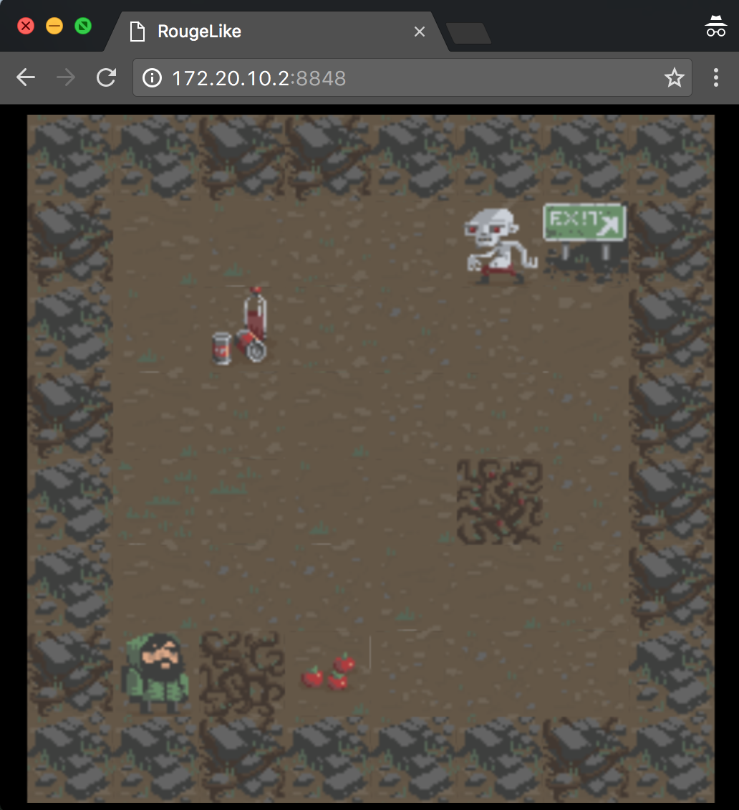

# Rougelike

A web version demo for [RougeLike](https://unity3d.com/cn/learn/tutorials/projects/2d-roguelike-tutorial)

## Run

```sh
$ npm install
$ npm run build
```

Then start a web server and visit the `index.html`

</img>
